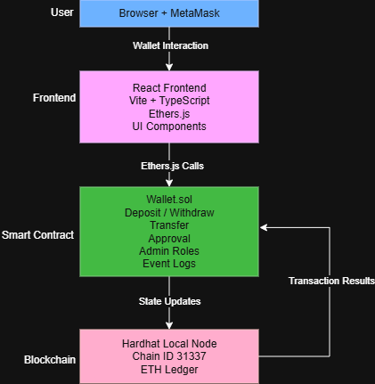
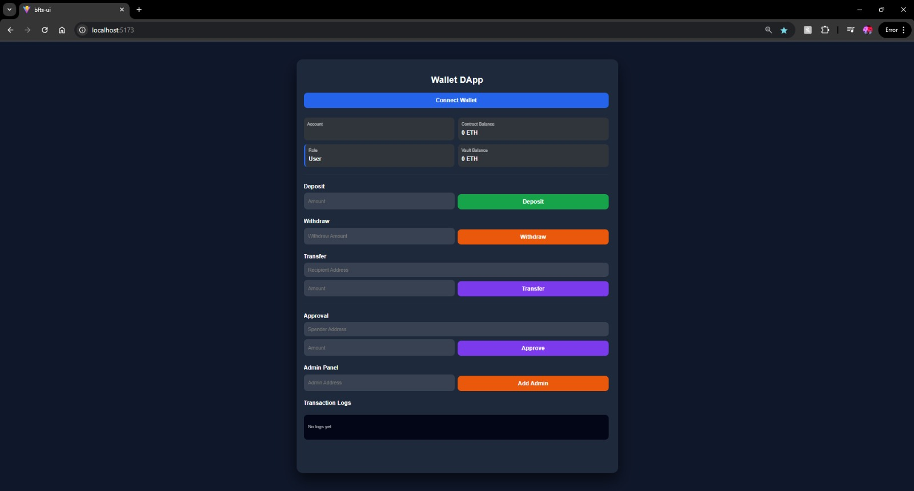
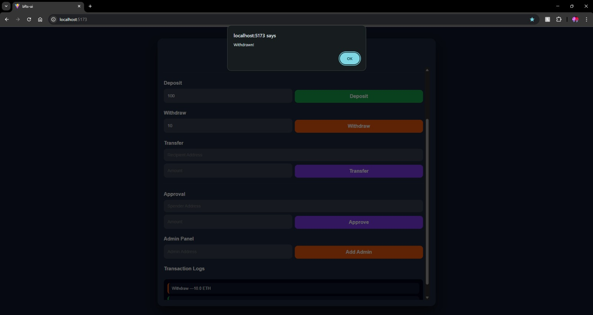
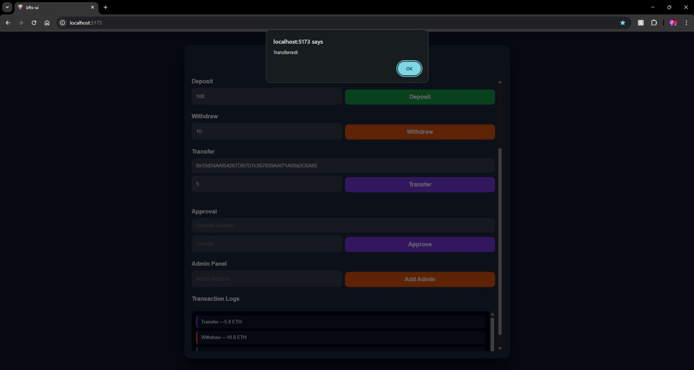
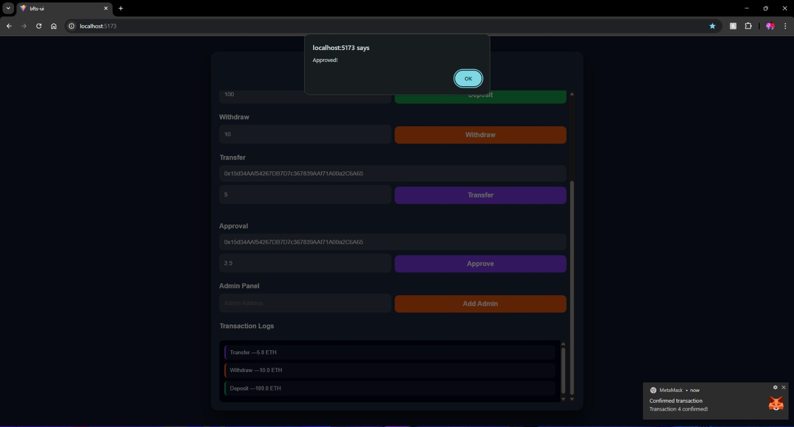
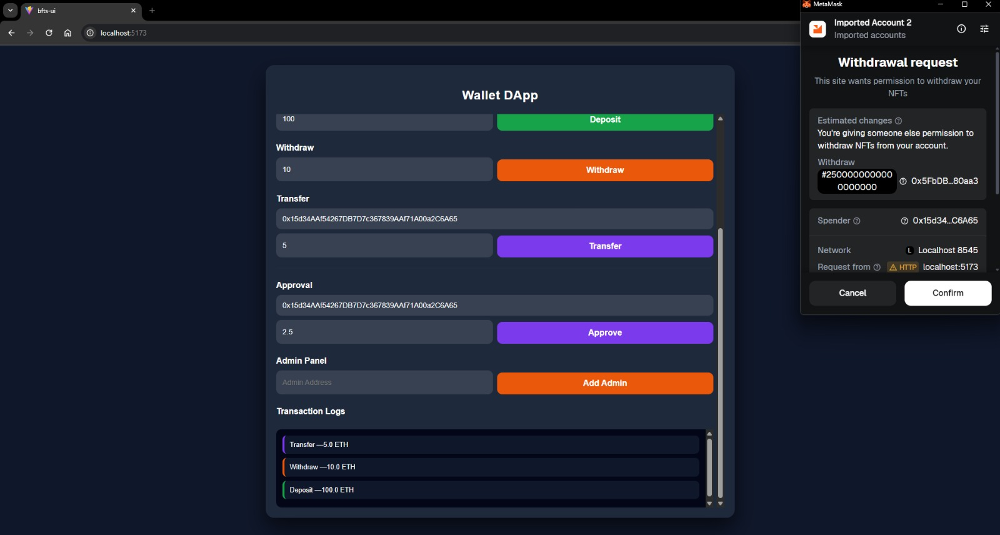
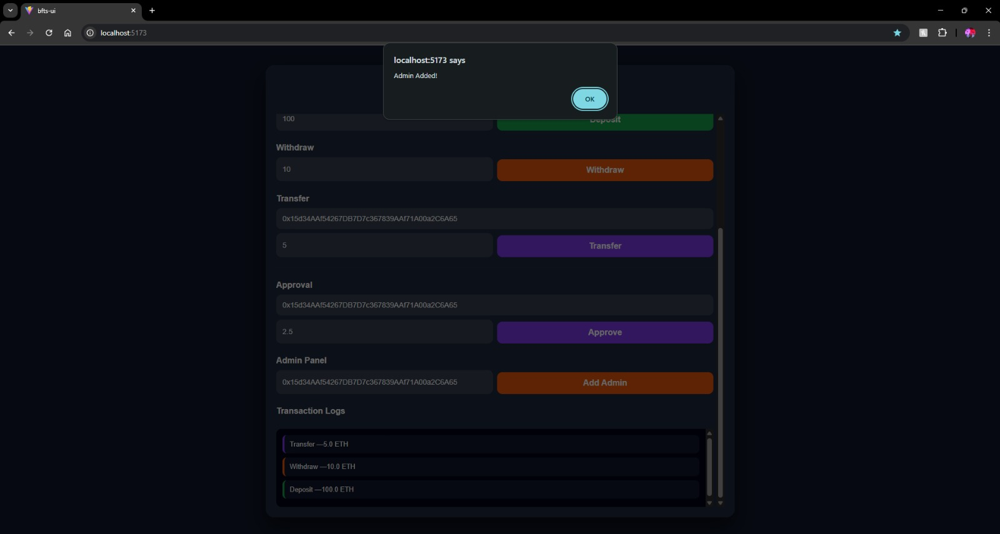

# 🚀 Wallet DApp – Blockchain-Based Fund Transfer System

A decentralized wallet application built using Solidity, Hardhat, React, and Ethers.js.

This project implements a secure on-chain vault system supporting deposits, withdrawals, transfers, delegated approvals, admin role management, and real-time transaction logs.

## 📌 Overview

This DApp simulates a blockchain-based fund transfer system where:

.Users deposit ETH into a smart contract vault
.Withdraw ETH securely
.Transfer internally between users
.Grant spending approval to other users
.Manage admin roles (owner-controlled)
.View transaction logs

The system follows Ethereum’s Account-Based Model and includes core blockchain security practices.

## 🛠 Tech Stack

Solidity ^0.8.x
Hardhat
React + Vite + TypeScript
Ethers.js (v6)
MetaMask

✨ Features

🔐 Wallet Connection (MetaMask)

💰 Deposit ETH into Vault

💸 Withdraw ETH

🔄 Internal Transfers

🧾 Approval & Allowance Logic

👑 Admin Role Management

📜 Transaction Event Logs

🛡 Reentrancy Protection

🔎 Network Detection

🔄 Auto Balance Updates

🚪 Logout / Session Control

## 📜 Smart Contract Functions

Function Description
deposit() - Add ETH to vault
withdraw(uint256) - Withdraw ETH
transferTo(address,uint256) - Internal balance transfer
approve(address,uint256) - Grant allowance
transferFrom(address,address,uint256) - Delegated transfer
addAdmin(address) - Add admin
removeAdmin(address) - Remove admin
getBalance(address) - User vault balance
getContractBalance() - Total vault ETH

## 🔐 Security Measures

This project implements several blockchain security best practices:

- Reentrancy Guard (locked modifier)
- Access Control (onlyOwner, onlyAdmin)
- Input validation (address & amount checks)
- Safe ETH transfers using .call
- Event logging for auditability
- Separation of Wallet ETH vs Vault ETH
- Allowance reduction after delegated transfer
- Frontend address validation (ethers.isAddress())

These protections prevent:

- Reentrancy attacks
- Unauthorized admin access
- Invalid transactions
- Double-spending logic issues

## 🧠 Account Model vs UTXO Model

Ethereum – Account Model

- Ethereum uses an Account-Based Model, where balances are directly stored on-chain.

In this project, balances are maintained using:

mapping(address => uint256) balances;

Advantages:

.Simple balance tracking
.Efficient smart contract integration
.Fast state updates
.Easier role & approval logic

Bitcoin – UTXO Model

- Bitcoin uses a UTXO (Unspent Transaction Output) model.

Instead of balances, the system tracks individual transaction outputs.

Advantages:

.Higher privacy
.Parallel transaction validation
.Explicit transaction flow

Why Account Model Was Used

This Wallet DApp includes:

.Role-based access control
.Internal transfers
.Delegated approvals
.Vault balance tracking

These features are significantly simpler and cleaner using the Account Model.

## ⚙️ Smart Contract Architecture

The Wallet.sol contract acts as a secure on-chain vault system.

Core Data Structures
mapping(address => uint256) balances;
mapping(address => bool) admins;
mapping(address => mapping(address => uint256)) allowances;

1️⃣ Deposit Logic

function deposit() public payable

-Validates non-zero value
-Updates internal ledger
-Emits Deposit event

2️⃣ Withdraw Logic

function withdraw(uint256 amount)

-Checks internal balance
-Uses .call for safe ETH transfer
-Protected by reentrancy guard

Emits Withdraw event

3️⃣ Transfer Logic

function transferTo(address to, uint256 amount)

-Internal balance transfer
-Prevents zero address
-Emits Transfer event

4️⃣ Approval Logic

function approve(address spender, uint256 amount)
function transferFrom(address from, address to, uint256 amount)

-Enables delegated transfers
-Restricts spending via allowance
-Reduces allowance after transfer

5️⃣ Access Control
modifier onlyOwner
modifier onlyAdmin

-Owner manages admin roles
-Controlled permission system

## 🚀 How To Run

Backend (Hardhat)

npm install
npx hardhat node
npx hardhat compile
npx hardhat run scripts/deploy.ts --network localhost

Frontend

cd frontend
npm install
npm run dev

## 🌐 Add Hardhat Network to MetaMask

Open MetaMask → Add Network → Manual Configuration:

.Network Name: Hardhat Local
.RPC URL: http://127.0.0.1:8545
.Chain ID: 31337
.Currency Symbol: ETH
.Block Explorer URL: (leave empty)

After adding:

.Import one of the private keys shown in the Hardhat terminal
.Use that account to interact with the DApp

## 📸 Screenshots

### UI Screens

### Main Dashboard

### Architecture

### Deposit & Withdraw

### Transfer Flow

### Approval Logic

### Admin Panel

